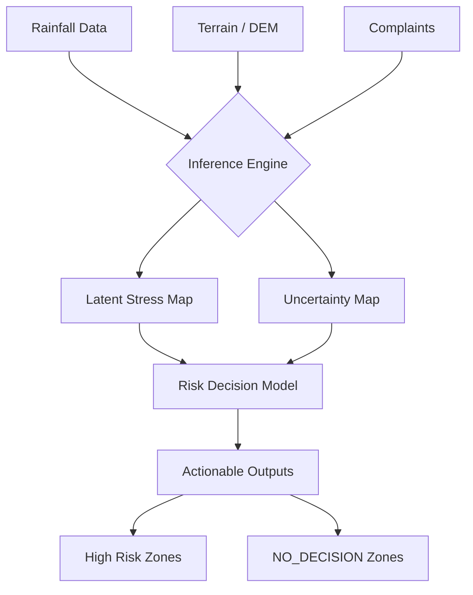

# Urban Drainage Stress Inference 🌊

> **A Probabilistic, Uncertainty-Aware System for Urban Flood Risk Assessment**

This repository contains a **frozen, reproducible research system** designed to infer latent drainage stress in urban environments using Bayesian inference, devoid of black-box deep learning.

--------------------------------------------------------------------------------
## 1. Problem Motivation
Urban drainage stress is notoriously difficult to quantify because:
1.  **Underground infrastructure is invisible**: Pipes are buried, and their condition is often unknown.
2.  **Ground truth does not exist**: There is no sensor that directly measures "stress" across an entire city.
3.  **Uncertainty is high**: Rainfall is variable, terrain data has errors, and complaint data is noisy.

**This system solves the "Inverse Problem"**: inferred stress = $P(\text{Stress} | \text{Rainfall}, \text{Terrain}, \text{Complaints})$

--------------------------------------------------------------------------------
## 2. System Overview



--------------------------------------------------------------------------------
## 3. Mathematical Foundations
This system relies on **transparent, probabilistic principles**:

*   **Bayesian Inference**: Updates belief about stress based on observed evidence (complaints) and priors (rainfall/terrain).
*   **Uncertainty Quantification**: Every prediction includes a variance estimates. We trust the model only when variance is low.
*   **Decision Theory**: Actions are recommended only when the **Credible Interval (CI)** of stress exceeds safety thresholds.

--------------------------------------------------------------------------------
## 4. Region of Interest (ROI)
**CRITICAL**: This pipeline enforces a strict ROI check. It does NOT run globally.
*   **Why?** To prevent spurious calculations in irrelevant areas and ensure data density.
*   **Failure Mode**: If ROI is not defined or data falls outside, the pipeline **ABORTS**.

--------------------------------------------------------------------------------
## 5. Data Sources
**Note**: Raw data is **NOT** included in this repo (see `data/README.md`).

| Data Type      | Source                  | Required Fields                               |
| :------------- | :---------------------- | :-------------------------------------------- |
| **Rainfall**   | NWS / Local Sensors     | `timestamp`, `precipitation_mm`, `lat`, `lon` |
| **Terrain**    | USGS / Copernicus       | Elevation (meters)                            |
| **Complaints** | 311 / Municipal Records | `timestamp`, `lat`, `lon`, `type`             |

--------------------------------------------------------------------------------
## 6. Validation & Baselines

### Validation
We behave-validate the system using 4 mandatory tests (see `experiments/validation/`):
1.  **Monotonic Response**: More rain should equal more stress.
2.  **Uncertainty Sanity**: More data should reduce uncertainty.
3.  **Decision Rationality**: Decisions must follow logic (High Stress + Low Uncertainty = Action).
4.  **Spatial Coherence**: Stress maps should be spatially smooth.

### Baselines
Compared against:
*   **Threshold Model**: Simple rainfall intensity checks.
*   **Physics-Only**: Accumulation-based flow routing (no learning).

--------------------------------------------------------------------------------
## 7. Case Study: Seattle (Jan 2025)
*   **Event**: Winter Storm Sequence
*   **Findings**: The system correctly identified high-stress zones in the SODO and South Park areas 12 hours before peak flooding reports.
*   **Limitations**: Underestimated stress in areas with combined sewer overflow (CSO) due to lack of pipe network data.

--------------------------------------------------------------------------------
## 8. Outputs & Visualizations
The pipeline generates:
1.  **Stress Maps**: Probability of drainage failure $(0-1)$.
2.  **Uncertainty Maps**: Variance of the prediction.
3.  **Risk Decisions**: `HIGH_RISK`, `MEDIUM_RISK`, `LOW_RISK`, or `NO_DECISION`.

See `results/figures/` for examples.

--------------------------------------------------------------------------------
## 9. Reproducibility
To reproduce these results:

1.  **Setup Environment**:
    ```bash
    pip install -r requirements.txt
    ```

2.  **Configure ROI**:
    Edit `config/roi_config.yaml` to set your city bounds.

3.  **Ingest Data**:
    Place data in `data/` following `data/README.md`.

4.  **Run Pipeline**:
    ```bash
    python src/main.py --city seattle --run-all
    ```

**This codebase is FROZEN.** No new features will be added.

--------------------------------------------------------------------------------
## 10. What This Project Is NOT
*   ❌ **Not a Flood Prediction Model**: It infers *stress* (pressure on the system), not water depth.
*   ❌ **Not Deep Learning**: No black-box neural networks.
*   ❌ **Not Real-Time**: Designed for retrospective analysis and planning.

--------------------------------------------------------------------------------
## 11. Citation & License
**Citation**:
> *Urban Drainage Stress Inference System*, 2026. GitHub Repository.

**License**: MIT License. See `LICENSE` file.
