# Urban Drainage Stress Inference System 🌊

> **A Probabilistic, Uncertainty-Aware System for Urban Flood Risk Assessment**

This repository contains a **production-grade research system** designed to infer latent drainage stress in urban environments. It combines **Bayesian inference** with a **Latent Spatio-Temporal Graph Neural Network (ST-GNN)** to correct physics-based residuals without compromising safety or decision validity.

---

## ✅ Final Training Results (January 2026)

| Metric                        | Value            | Status         |
| ----------------------------- | ---------------- | -------------- |
| **OOD Calibrated**            | `True`           | ✅              |
| **NYC > Seattle Uncertainty** | 420x higher      | ✅              |
| **DL Fraction**               | 2.17%            | ✅ (Supportive) |
| **All Audits**                | Passed           | ✅              |
| **System Status**             | Production Ready | ✅              |

## ⚡ Quick Start & Workflow

Follow this **exact sequence** to run the full pipeline, from architectural verification to final deployment.

### 1. Architectural Verification
First, verify that the ST-GNN components, guards, and loss functions are working correctly.
```bash
python scripts/test_latent_architecture.py
```

### 2. Manual Verification Training
Train the model manually on Seattle data to confirm safety constraints (NYC > Seattle Uncertainty) and sign correctness.
```bash
python scripts/train_latent_model.py
```
> **Check**: Verify `results/comprehensive_training/audit_report.json` passes all checks.

### 3. Auto-Hyperparameter Optimization
Once the architecture is verified, run the auto-optimizer to find the best hyperparameters (learning rate, hidden dims, etc).
```bash
python src/ml/auto_opt/run_auto_optimization.py
```

### 4. Full System Deployment
Run the complete end-to-end system, including physics inference, DL correction, and risk decision making.
```bash
python run_complete_system.py
```

---

## 📂 Key Modules & Recent Updates

We have recently implemented a **Scale-Free Structural Residual Learner** architecture. Here are the critical files:

### Phase 1: Guards & Safety
*   `src/ml/guards/input_sanity_checks.py`: Enforces Z-score inputs (no raw scales).
*   `src/ml/guards/uncertainty_guards.py`: Ensures DL uncertainty is strictly additive.
*   `src/ml/audit/dl_role_audit.py`: Automated auditor that refuses to run if the DL model violates its role.

### Phase 2: Core Architecture
*   `src/ml/models/st_gnn_latent.py`: **Latent ST-GNN**. Operates in scale-free space. Uses Spectral Normalization for OOD safety.
*   `src/ml/targets/latent_residual.py`: Computes the target $\Delta Z$ structural residuals.

### Phase 3: Training & Inference
*   `src/ml/training/latent_losses.py`: Scale-invariant composite loss ($\alpha \text{MSE} + \beta \text{NLL} + \gamma \text{Smooth} + \eta \text{Rank}$).
*   `src/ml/inference/latent_inference.py`: Inference pipeline with runtime guards.
*   `src/ml/auto_opt/run_auto_optimization.py`: Optuna-based hyperparameter tuning engine.

---

## 📋 System Overview

```mermaid
graph TD
    A[🌧️ Rainfall Data] --> C{🔬 Inference Engine}
    B[🏔️ Terrain / DEM] --> C
    D[📞 Complaints] --> C
    
    C --> P[Physics Baseline]
    C --> L[🧠 Latent ST-GNN]
    
    P --> F[Fused Stress]
    L --> F
    
    F --> G[⚖️ Risk Decision Model]
    
    G --> H[✅ Actionable Outputs]
    H --> I[🔴 High Risk Zones]
    H --> J[⚪ NO_DECISION Zones]
```



## 🧠 Deep Learning Architecture (ST-GNN)

The Deep Learning module is a **Structural Residual Learner**. 

*   **Role**: It learns to correct the biases of the physics model (e.g., missing pipe data capabilities) by predicting a residual $\Delta Z$ in a latent space.
*   **Constraint 1**: It **NEVER** sees raw magnitude values (only Z-scores).
*   **Constraint 2**: It **NEVER** makes the final decision. It only adjusts the belief state.
*   **Constraint 3**: It **MUST** be more uncertain on data it hasn't seen (OOD).

## 📊 Outputs

The system produces:
1.  **Latent Stress Map**: Probability of failure (0-1).
2.  **Uncertainty Map**: Confidence in the prediction.
3.  **Action Recommendations**: High/Medium/Low risk zones.

See `results/` for generated maps and `audit_report.json` for validation logs.

---

## 🔗 Citation & License

**Citation**:
```bibtex
@software{urban_drainage_stress_2026,
  title = {Urban Drainage Stress Inference System},
  author = {Shivanshu Tiwari},
  year = {2026},
  url = {https://github.com/imshivanshutiwari/urban-drainage-stress}
}
```

**License**: MIT License. See `LICENSE` file.
