# Urban Drainage Stress Inference 🌊

> **A Probabilistic, Uncertainty-Aware System for Urban Flood Risk Assessment**

This repository contains a **frozen, reproducible research system** designed to infer latent drainage stress in urban environments using Bayesian inference, devoid of black-box deep learning.

<p align="center">
  
  
</p>

--------------------------------------------------------------------------------
## 📋 Table of Contents
- [Problem Motivation](#1-problem-motivation)
- [System Overview](#2-system-overview)
- [Mathematical Foundations](#3-mathematical-foundations)
- [Region of Interest (ROI)](#4-region-of-interest-roi)
- [Data Sources](#5-data-sources)
- [Validation & Baselines](#6-validation--baselines)
- [Case Study: Seattle](#7-case-study-seattle-jan-2025)
- [Outputs & Visualizations](#8-outputs--visualizations)
- [Reproducibility](#9-reproducibility)
- [What This Is NOT](#10-what-this-project-is-not)
- [Citation & License](#11-citation--license)

--------------------------------------------------------------------------------
## 1. Problem Motivation
Urban drainage stress is notoriously difficult to quantify because:
1.  **Underground infrastructure is invisible**: Pipes are buried, and their condition is often unknown.
2.  **Ground truth does not exist**: There is no sensor that directly measures "stress" across an entire city.
3.  **Uncertainty is high**: Rainfall is variable, terrain data has errors, and complaint data is noisy.

**This system solves the "Inverse Problem"**: inferred stress = $P(\text{Stress} | \text{Rainfall}, \text{Terrain}, \text{Complaints})$

--------------------------------------------------------------------------------
## 2. System Overview

```mermaid
graph TD
    A[🌧️ Rainfall Data] --> C{🔬 Inference Engine}
    B[🏔️ Terrain / DEM] --> C
    D[📞 Complaints] --> C
    
    C --> E[📊 Latent Stress Map]
    C --> F[📈 Uncertainty Map]
    
    E --> G[⚖️ Risk Decision Model]
    F --> G
    
    G --> H[✅ Actionable Outputs]
    H --> I[🔴 High Risk Zones]
    H --> J[⚪ NO_DECISION Zones]
```



--------------------------------------------------------------------------------
## 3. Mathematical Foundations
This system relies on **transparent, probabilistic principles**:

| Principle                      | Description                                                                                          |
| ------------------------------ | ---------------------------------------------------------------------------------------------------- |
| **Bayesian Inference**         | Updates belief about stress based on observed evidence (complaints) and priors (rainfall/terrain)    |
| **Uncertainty Quantification** | Every prediction includes variance estimates. We trust the model only when variance is low           |
| **Decision Theory**            | Actions are recommended only when the **Credible Interval (CI)** of stress exceeds safety thresholds |

--------------------------------------------------------------------------------
## 4. Region of Interest (ROI)
> ⚠️ **CRITICAL**: This pipeline enforces a strict ROI check. It does NOT run globally.

*   **Why?** To prevent spurious calculations in irrelevant areas and ensure data density.
*   **Failure Mode**: If ROI is not defined or data falls outside, the pipeline **ABORTS**.

--------------------------------------------------------------------------------
## 5. Data Sources
> 📁 **Note**: Raw data is **NOT** included in this repo (see [`data/README.md`](data/README.md)).

| Data Type      | Source                  | Required Fields                               |
| :------------- | :---------------------- | :-------------------------------------------- |
| **Rainfall**   | NWS / Local Sensors     | `timestamp`, `precipitation_mm`, `lat`, `lon` |
| **Terrain**    | USGS / Copernicus       | Elevation (meters)                            |
| **Complaints** | 311 / Municipal Records | `timestamp`, `lat`, `lon`, `type`             |

--------------------------------------------------------------------------------
## 6. Validation & Baselines

### ✅ Behavioral Validation
We validate the system using 4 mandatory sanity tests (see [`experiments/validation/`](experiments/validation/)):

| Test                     | What It Checks                         |
| ------------------------ | -------------------------------------- |
| **Monotonic Response**   | More rain → more stress                |
| **Uncertainty Sanity**   | More data → less uncertainty           |
| **Decision Rationality** | High Stress + Low Uncertainty = Action |
| **Spatial Coherence**    | Stress maps are spatially smooth       |

### 📊 Baselines
Compared against:
*   **Threshold Model**: Simple rainfall intensity checks
*   **Physics-Only**: Accumulation-based flow routing (no learning)

<p align="center">
  
</p>

--------------------------------------------------------------------------------
## 7. Case Study: Seattle (Jan 2025)

| Aspect          | Details                                                                                                    |
| --------------- | ---------------------------------------------------------------------------------------------------------- |
| **Event**       | Winter Storm Sequence                                                                                      |
| **Findings**    | System identified high-stress zones in SODO and South Park areas **12 hours before** peak flooding reports |
| **Limitations** | Underestimated stress in areas with combined sewer overflow (CSO) due to lack of pipe network data         |

<p align="center">
  
</p>

--------------------------------------------------------------------------------
## 8. Outputs & Visualizations
The pipeline generates:

| Output                 | Description                                              |
| ---------------------- | -------------------------------------------------------- |
| 📊 **Stress Maps**      | Probability of drainage failure (0-1)                    |
| 📈 **Uncertainty Maps** | Variance of the prediction                               |
| ⚖️ **Risk Decisions**   | `HIGH_RISK`, `MEDIUM_RISK`, `LOW_RISK`, or `NO_DECISION` |

<details>
<summary>🖼️ <b>Click to view all 15 core visualizations</b></summary>

<p align="center">
  
  
  
</p>
<p align="center">
  
  
  
</p>
<p align="center">
  
  
  
</p>
<p align="center">
  
  
  
</p>
<p align="center">
  
  
  
</p>

</details>

--------------------------------------------------------------------------------
## 9. Reproducibility
To reproduce these results:

```bash
# 1. Setup Environment
pip install -r requirements.txt

# 2. Configure ROI (edit config/roi_config.yaml)

# 3. Place data in data/ (see data/README.md)

# 4. Run Pipeline
python src/main.py --city seattle --run-all
```

> 🔒 **This codebase is FROZEN.** No new features will be added.

--------------------------------------------------------------------------------
## 10. 🧠 Deep Learning Module (ST-GNN)

> **NEW**: Optional Spatio-Temporal Graph Neural Network for residual correction.

### Key Principle: Residual Learning
The DL module does **NOT** replace the physics + Bayesian system. It learns **residual corrections**:

```
Final_Stress = Bayesian_Stress + DL_Residual
```



```mermaid
graph LR
    A[🌧️ Inputs] --> B[🔬 Bayesian<br/>Inference]
    A --> C[🧠 ST-GNN]
    B --> D[Base Stress]
    C --> E[Residual ∆]
    D --> F((+))
    E --> F
    F --> G[✅ Final Stress]
    
    style C fill:#e1f5fe
    style E fill:#e1f5fe
```

### Architecture
| Component      | Description                                |
| -------------- | ------------------------------------------ |
| **Spatial**    | GraphSAGE layers on drainage network graph |
| **Temporal**   | Transformer attention across time steps    |
| **Dual Heads** | Residual prediction + Uncertainty proxy    |

### Critical Constraints
- ❌ DL **CANNOT** override `NO_DECISION` zones
- ❌ DL **CANNOT** make final decisions alone
- ✅ DL only **corrects** what physics misses
- ✅ DL provides **additional uncertainty** estimates

### Configuration
See [`config/ml_config.yaml`](config/ml_config.yaml) for all ML parameters.

```bash
# Run with ML enabled
python src/main.py --city seattle --run-all --with-ml

# Run without ML (baseline)
python src/main.py --city seattle --run-all --no-ml
```

--------------------------------------------------------------------------------
## 11. What This Project Is NOT
| ❌                                | Description                                                  |
| -------------------------------- | ------------------------------------------------------------ |
| **Not a Flood Prediction Model** | It infers *stress* (pressure on the system), not water depth |
| **Not Pure Deep Learning**       | DL is supportive, not dominant (Bayesian backbone)           |
| **Not Real-Time**                | Designed for retrospective analysis and planning             |

--------------------------------------------------------------------------------
## 12. Citation & License

**Citation**:
```bibtex
@software{urban_drainage_stress_2026,
  title = {Urban Drainage Stress Inference System},
  author = {Shivanshu Tiwari},
  year = {2026},
  url = {https://github.com/imshivanshutiwari/urban-drainage-stress}
}
```

**License**: MIT License. See [`LICENSE`](LICENSE) file.

---
<p align="center">
  Made with 🔬 science and ☕ coffee
</p>
