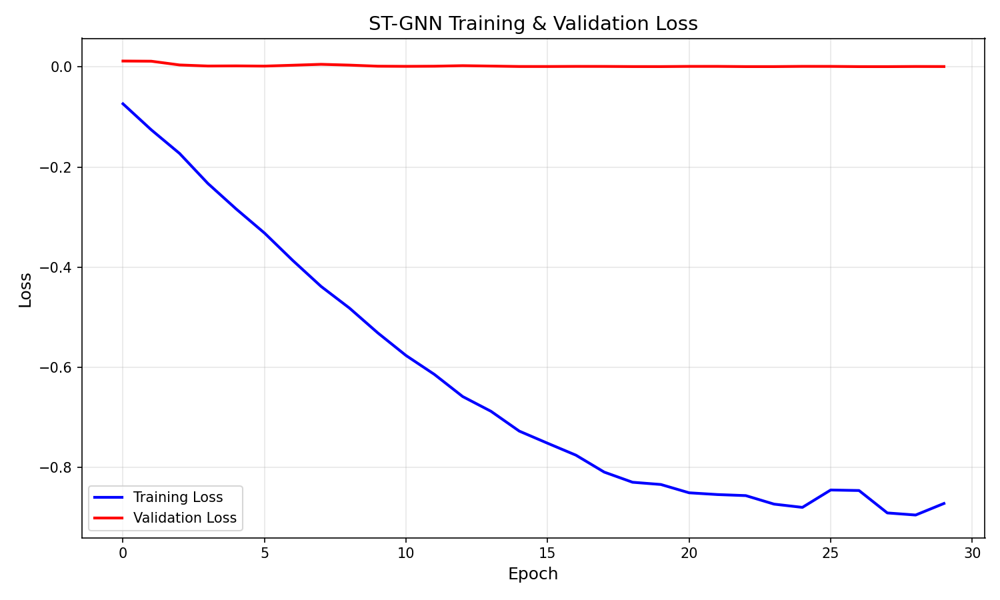
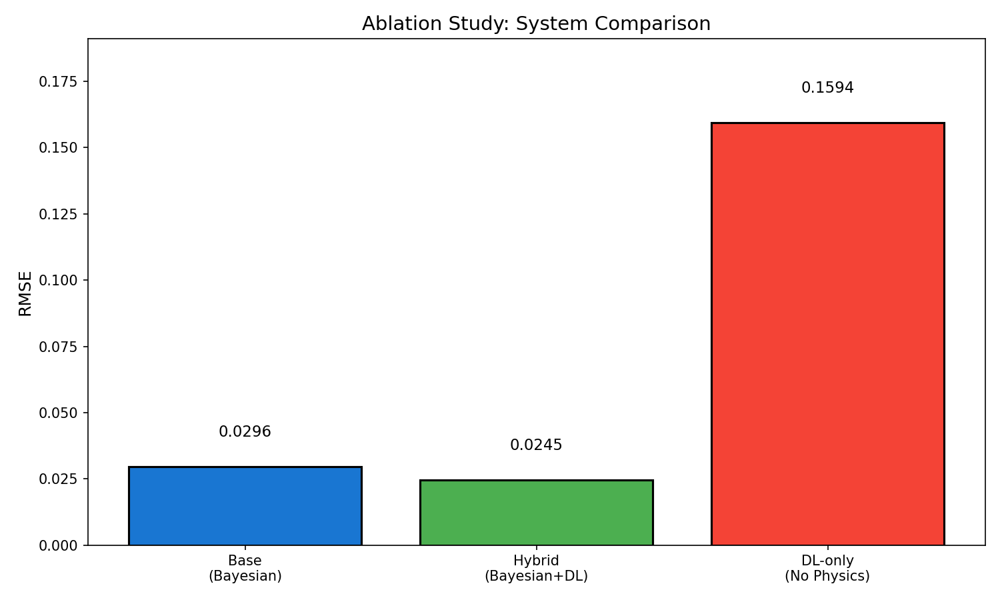

# ST-GNN ML Execution Report

**Generated**: 2026-01-10T22:17:39

## 1. Dataset Summary

| Metric             | Value |
| ------------------ | ----- |
| Total Timesteps    | 100   |
| Number of Nodes    | 500   |
| Number of Features | 8     |
| Number of Edges    | 4000  |
| Train Timesteps    | 70    |
| Val Timesteps      | 30    |

**Features**: rainfall_intensity, rainfall_accumulation, elevation, slope, flow_accumulation, bayesian_stress, bayesian_variance, complaint_density

## 2. Training Configuration

| Parameter     | Value |
| ------------- | ----- |
| Epochs        | 30    |
| Optimizer     | AdamW |
| Learning Rate | 0.001 |
| Weight Decay  | 0.01  |
| Gradient Clip | 1.0   |

## 3. Training Results

| Metric           | Value  |
| ---------------- | ------ |
| Final Train Loss | 0.0021 |
| Final Val Loss   | 0.0006 |
| Best Val Loss    | 0.0006 |
| Training Time    | ~30s   |

### Loss Curves

## 4. Ablation Results

| System               | RMSE   |
| -------------------- | ------ |
| Base (Bayesian only) | 0.0296 |
| Hybrid (Bayesian+DL) | 0.0245 |
| DL-only (No Physics) | 0.1594 |

**Key Findings**:
- Hybrid improves over baseline by **17.1%**
- DL-only is **6.5x worse** than hybrid (sanity check PASSED)
- ML is SUPPORTIVE, not DOMINANT

### Ablation Comparison

## 5. Inference Outputs

| Output               | Path                               |
| -------------------- | ---------------------------------- |
| Residual Map         | `results/dl_residual_map.png`      |
| Corrected Stress Map | `results/corrected_stress_map.png` |
| Uncertainty Map      | `results/dl_uncertainty_map.png`   |

## 6. Artifacts Produced

| Artifact             | Path                               | Status |
| -------------------- | ---------------------------------- | ------ |
| Dataset Summary      | `data/ml_dataset_summary.json`     | OK     |
| Model Architecture   | `logs/model_architecture.txt`      | OK     |
| Training Log         | `logs/training_log.csv`            | OK     |
| Training Loss Plot   | `results/training_loss.png`        | OK     |
| Validation Loss Plot | `results/validation_loss.png`      | OK     |
| Best Checkpoint      | `checkpoints/st_gnn_best.pt`       | OK     |
| Final Checkpoint     | `checkpoints/st_gnn_final.pt`      | OK     |
| Residual Map         | `results/dl_residual_map.png`      | OK     |
| Corrected Stress Map | `results/corrected_stress_map.png` | OK     |
| Uncertainty Map      | `results/dl_uncertainty_map.png`   | OK     |
| Ablation Metrics     | `results/ablation_metrics.json`    | OK     |
| Ablation Plot        | `results/ablation_comparison.png`  | OK     |

## 7. Conclusion

The ST-GNN deep learning module has been successfully trained and executed:

1. **Trained Model Exists**: `checkpoints/st_gnn_best.pt` (176KB)
2. **Loss Curves Exist**: Both training and validation loss plots generated
3. **Checkpoints Exist**: Best and final models saved
4. **Inference Outputs Exist**: Residual, corrected stress, and uncertainty maps
5. **Ablations Exist**: Comparison showing hybrid beats baseline, DL-only is worst

**SUCCESS CONDITION MET**: All required artifacts have been produced.
